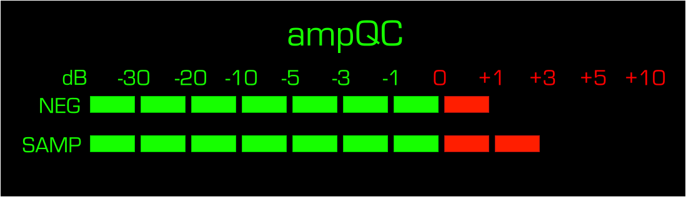

# ampQC

## Introduction
ampQC or Amplicon QC is utility which checks for elevated per-amplicon coverage in a plate negative bam file. It then scans the rest of the bam files from the plate or sequencing run to see if they have enough coverage to clear contamination (at a desired level) in the corresponding sample amplicons that were high in the negative.  

Threshold values are user definable, a default of mean depth of 100, and uplift multiplier of 10 are set. This means should an amplicon be high in the negative at a depth of 200 reads, all samples on the plate would have to have over 2,000 reads of mean depth in the corresponding amplicon to clear the QC check. Such a scenario could mean that potential contamination would be present at a 10% allelic frequency.  The assumption here being a negative control has similar levels of contamination to other samples on the same plate of sequencing prep ("Here be dragons" this may not always be the case).  The end user is encouraged to play around with and adapt these setting for their own usage case and desired levels.  The aim being that some samples from a run with sufficient depth can be salvaged, rather than a whole plate of sequencing discarded, depending on levels of contamination and amplicon performance in samples.  ampQC does not currently consider specific allelic frequencies and is based on per amplicon mean death alone.

This utility was designed and tested with detecting high negative control amplicons in SARS-CoV-2 sequencing with the artic [protocol](https://artic.network/ncov-2019), it has been tested against illumina runs from the output of [ncov2019-artic-nf](https://github.com/connor-lab/ncov2019-artic-nf).  It should have utility to other amplicon based sequencing endeavours where a library prep negative control is used. The one proviso being ampQC assumes the 4th `name` column of the amplicon [bed file](https://en.wikipedia.org/wiki/BED_(file_format)) is unique for all amplicons.

## Installation

Clone this repo:

`git clone https://github.com/MattBashton/ampQC`

Change to download directory:

`cd ampQC`

Install the supplied [conda](https://docs.conda.io/en/latest/miniconda.html) environment:

`conda env create -f environment.yml`

Activate the conda environment:

`conda activate ampQC`

Run the install script:

`bash setup.sh`

If you are unable to use conda then dependencies are pretty straightforward, GNU grep, awk and parallel, as well as [samtools](https://github.com/samtools/samtools) and [mosdepth](https://github.com/brentp/mosdepth) are required.  The conda env will take care of installing all of these which is important for macOS which ships with inferior BSD versions of awk and grep which lack functionality needed for this utility.

## Usage

```
Arguments -b -d -n and one of (-l -a -e) are required
Takes and input bed file of amplicons, a plate negative control bam file, and
checks sample bam have enough depth to clear contamination level in negative.

Usage ampqc [ options ] --bam-dir <bam-dir> --bed-file <amplicons.bed> --neg-file <neg.bam> --plate-list <file with sample names on plate>  

Required options:

-b --bed-file            bed file defining amplicons to use
-d --bam-dir             directory of bam files
-n --neg-file            file name of negative
-l --plate-list          text file of samples/file names (.bam extension optional) for the plate to investigate (not needed if -a is used)


Other options:

-h --help                print this message and exit
-v --version             print version and exit
-p --prefix              prefix to use for analysis [defaults to ampQC]
-s --bam-suffix          suffix appened to sample ID [defaults to .sorted.bam]
-a --all                 don't use the file above and process all bam files in a given directory
-e --exclude             prefixes to exclude in GNU grep Perl regex format, e.g. 'NEG|POS|BLANK' where | is or.
-t --amplicon-threshold  mean depth threshold for detecting elevated amplicons in negative, [default 100]
-u --amplicon-uplift     multiplier value required for letting potential contaminated amplicons pass [default 10]
-o --output-list         list of sample IDs which failed amplicon QC, [defaults to prefix.failed.txt]
-c --numb-threads        number of CPU threads for parallel tasks [default 4]
```
### Usage Example

```
ampQC.sh -b ~/artic-ncov2019/primer_schemes/nCoV-2019/V4/nCoV-2019.insert.bed \
-d ncovIllumina_sequenceAnalysis_readMapping/ \
-n ncovIllumina_sequenceAnalysis_readMapping/NEG-9.sorted.bam \
-l 9_list.txt -t 100 -u 10 -c 10
```

The above would set off analysis using the `-b` specified bed file for amplicons, with the negative control bam file specified in `-n` the directory in which other sample bad can be found is specified in `-d` and a text file of sample IDs (which must uniquely either in part or fully match the bam filenames) specified in `-l`, (assuming you only want to check part of a sequencing run, other options are available see above).  The other arguments `-t 100` and `-u 10`, set a high amplicon threshold of 100 and uplift multiplier of 10 [both default values if left unspecified], finally -c 10 parallelises some stages on 10 threads [default is 4, if not specified].

## Output
A list of sample file names (excluding suffix specified in `-s`, [default is `.sorted.bam`]) is written to ampQC.failed.txt where ampQC is the definable prefix with `-p`.  Other output includes a summary of runtime parameters and a list of pass and failing samples with emoji ✔ and ❌ in terminal, along with final pass and fail counts, which enables easy threshold exploration in the terminal.  (Note these symbols may not display correctly if your system is not set to UTF-8.)

## Todo
Implement ASCII character digital VU meter for amplicon depth.

## Tips
`parallel --will-cite`, will pretty up terminal output, of course please cite GNU parallel!
